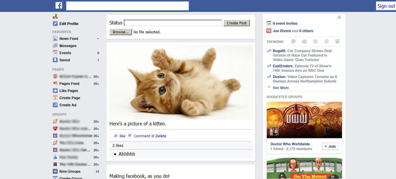

Facebook-ish
============

Project Description
-----

A Facebook like news feed, styled like Facebook.

User's can sign up/in/out. Post a status update, include an image if desired,
comment on other posts, like a post and delete their own posts.

The left and right columns are just images used for decoration.
The top bar displays any flash messages and sign up/in/out links.

To Do
---
Make all posts and comments user specific
Require a username at sign up and display on screen & in posts/comments
Add timestamps
Limit amount of posts displayed on index page
Add like for comments
Change commenting so it stays on same page
Limit like to once per post per user
Add user profile image and display on posts/comments